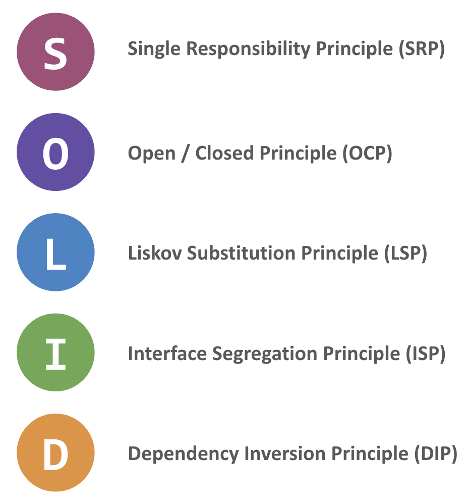

# SOLID

Illustration des principes __SOLID__ en TypeScript.

- Single Responsibility Principle (SRP)
- Open / Closed Principle (OCP)
- Liskov Substitution Principle (LSP)
- Interface Segregation Principle (ISP)
- Dependency Inversion Principle (DIP)

--

__Alexandre Leroux__  
_Enseignant / Formateur_  
_Développeur logiciel web & mobile_

Nancy (Grand Est, France)

<https://shrp.dev>
